# Iateria Wiki

The Iateria wiki will let you, the lucky user, explore an intuitive and informative website containing all the information needed to learn all you need to know about Iateria, a fantasy world created for players to engage in using the Dungeons and Dragons 5e ruleset. 

The site will contain useful information about the continent of Iateria, the various people that live there and the countries and factions they have formed. You will also learn about the magic that is abundant throughout the world of Iateria.

The Iateria Wiki will be useful for players about to engage in a role playing adventure set in the world of Iateria, for dungeon masters looking for inspiration for at plot or for experienced players of the world wanting to read up on a concept or place of interest they encounter when exploring the wonderous locations of Iateria.

The site was built as a part of a Diploma in software development, held by Code Institute and is in English for the pupose of assessment and mentoring. The site may be translated in to Swedish at a later date, as many in the target audience are Swedish.

[Visit the deployed site](https://oljung.github.io/portfolio-project-one/index.html)

## 1. User Experience

### 1.1 Project introduction

The website is designed to be used by a game master who created his own fantasy role playing game setting. The site will provide a platform for that person to share information about the setting in an ordered and organized way. The site will also aim to inspire others to try out the game or to take up the reins as a game master (dungeon master).

### 1.2 Design guidelines

The user visiting this site will likely have an idea of what role playing games are, and what to expect. As this is a fantasy setting, a color scheme was selected to represent a fantasy themed feeling, using green/grey shades and off-whites and yellow to represent old and faded documents. The site aims to inspire as well as inform, so images to represent the content are chosen to bring life to the content.

### 1.3 Project goals

- Provide the user with information about the fantsy setting in an order and structured manner

- Inspire users to explore the setting in a role playing game

- Provide information on further reading about Dungeons and Dragons, the game the setting is written for

### 1.4 Target audience

The main audience for the site are players of the game who are already in contact with the game master and need a site with all information about the game setting in one place for easy acces. The site is also suitable for other game masters who want a setting for their own campaigns, or inspiration for creating their own setting. Users new to the game may find the site inspiring and wanting to try out playing the game, so information about the game itself should be available through link. The two major categories of users are:

- Players in one of the game masters games<br>
Will visit the site for information about specific part of the setting. This user will want to stay up to date with any changed/added content.<br>
**Needs:** A menu that is intuitive and easy to navigate, with information organized in a structured and logical way. A way to get notifications about changes.<br>
**Goal:** Have information structured in a way that makes it easy for the user to find, and provide menues to subsections. Have some sort of notification of changes to content.<br>
**How:** Organize page content logically, so that topics can be found intuitively on each page. Design menues that are easy to use and clearly directs user to subesctions as well. To solve the ability to stay up to date with changes, a sign up form for newsletter will be provided

- Game masters looking for a setting<br>
Will want information about what to find on the page, giving them a grasp on how much content the setting has and then an easy way to navigate.<br>
**Needs:** A landing page giving a short information about what the site is about and what to find on the site, and good navigation.<br>
**Goal:** Use landing page to give the user quick inforamtion about what to find on the page.<br>
**How:** Design landing page to provide a short information about the page centered to draw attention to it.

### 1.5 User stories

- As an ownder, I want to quickly inform user of what to expect on my site.
- As an ownder, I want to provide information about the content in a logical and structured way.
- As an ownder, I want to provide ways for users to stay up to date with any changes I make to the content.
- As an ownder, I want to provide the users with ways to find additional reading about the role playing where the setting is used.
- As a user, I want to find information about a specific topic that i need to read more about.
- As a user, I want to find inspiration for creating my own fantasy setting.
- As a user, I want to stay up to date with any changes made.
- As a user, I want to learn more about Iateria and possibly use it for my own games.
- As a user, I want to read about a faction in the setting for creating a character.
- As a user, I want to read about races in the setting to know what my options are when creating a character.
- As a user, I want to find ways to learn more about role playing games in general.

### 1.6 Design

- Color scheme
    - The main color scheme is "dark slate grey" (#2F4F4F) and old lace (#FFF7EB) with a darker version of dark slate grey (#1F3333) and an orange color (#F28F3B) for variation. The background of the body (container margin) was given navajo white to keep to the theme of yellowy whites for the "old document" feeling.

- Typography
    - For the body text EB Garamond was used, as distinct and easy to read font. For the headers Nanum Gothic was chosen as it goes well with EB Garamond and has thinner but still distinct letters. A letter specing was used for headers to give them slightly more weight.

- Images
    - For the landing page an image of tattered and torn documents gives the feeling of old and ancient, to go with the fantasy theme. The other images on the site is there to make the user associate with both warriors and magicians, both common in fantasy.
    - Images for the pages are chosen to go with the topic of the text, and all major sections of the page has at least one image connected to it to bring life to the topic.

- Wireframes
    - Open this [pdf](assets/pdf/wireframe.pdf) to view the wireframes. Some changes were then made in the project, to improve readability and cohesiveness of the site.

## 2. Features

### 2.1 Existing features

- __Navigation bar__

    - Featured on all pages of the site, the navbar will contain 2 parts: A logo and menu to the main pages of the site, and a sub menu that will be specific to each site and subsite

    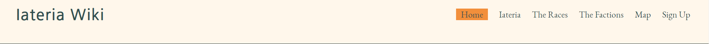


    - This feature will allow for easy navigation to the main parts of the sites.
    - Has a collapsable menu by clicking a "burger" icon on smaller screens.

    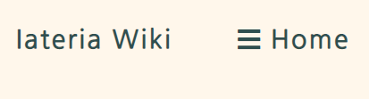

- __Subsection navigation bar__
    - This feature is a "hamburger" icon used to navigate the subsections of a information page on a smaller screen. On larger screens the menu is placed underneath the heading.

    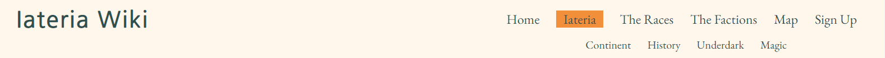

    For smaller screens:

    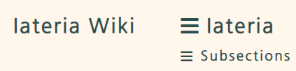

- __Landing Page__

    - The landing page has a hero image with a cover text greeting the user, and the image itself is meant to set the tone of the page, the old documents giving the ancient library theme. 

    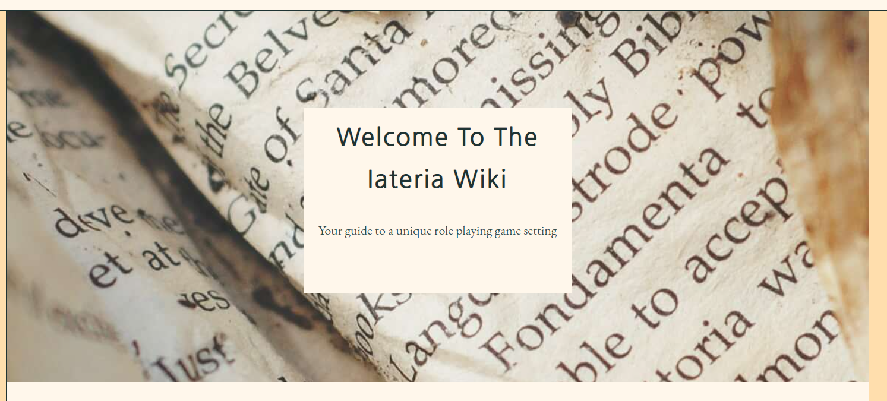

    - The center of the page then gives the user a short information about what Iateria is, and then the main content - what to find on the site.

    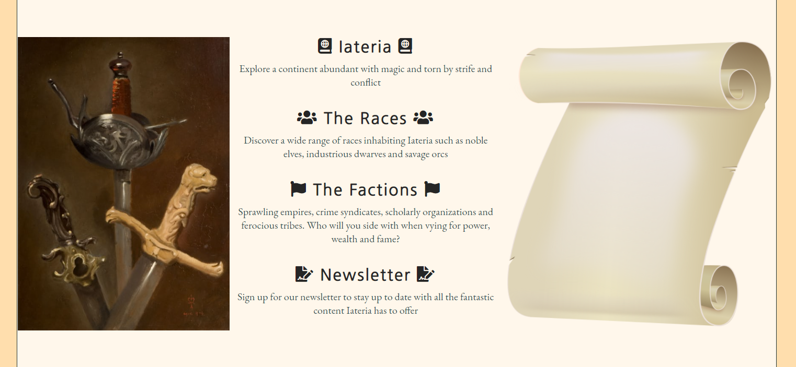

- __The footer__

    - The footer looks the same on every page of the site. It contains links to some of the sources referenced on the site, such as Wizards of the Coast (the company behind DnD) as well as where to find many of the rule books mentioned on the site.

    - Social media links to project social media accounts are also included in the footer to direct the user to our social media.
    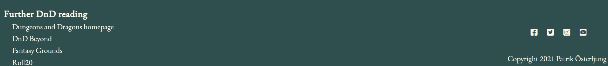
    - The footer has a different layout on smaller screens, working more vertically than horizontally.
    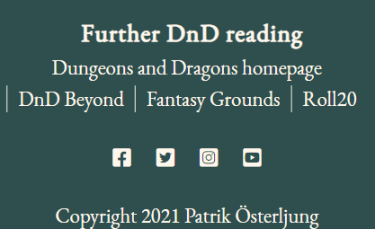

- __Info content__
    - All info content pages follow the same design, with sections made up of text-content and image content. On large screens the text and image are placed next to each other, alternating sides with each section. On smaller screens, they are placed vertically.<br>
    Large screen
    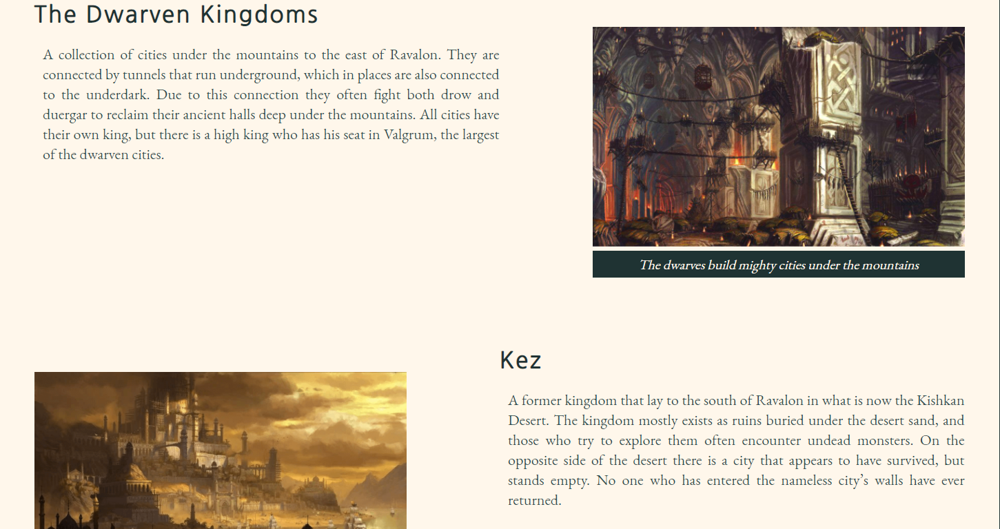
    Small screen
    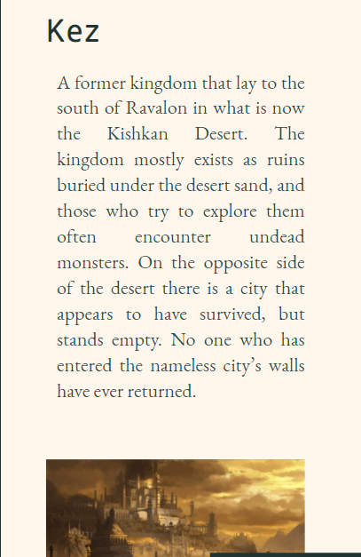

- __The Iateria page__

    - This feature is the first of the main parts of the site and contains information about the continent and its history.

    - Contains the subsections continent, history , underdark and magic, reachable via a subsection menu.

- __The races page__

    - This site gives a short presentation about the different races one might expect to find on the continent of Iateria.

    - The site also contains subsections for a number of different races, including humans, dwarves, elves and orcs.

- __The factions page__

    - This feature gives a brief rundown on the different nations, factions and alliances that currently exist on the continent.

    - This page has different subsections where additional information on many nations or factions will give the user more knowledge about the world of Iateria.

- __Sign up form__

    This sign up form will allow the user to sign up for a newsletter. At this point there is no database connected to it, so the action is not yet in place. Most of the design for this form was taken from the love running project on the CI course, but adapted to better suite the style of the page in term os coloring and backgrounds. The form has inputs for name and email, both required, as well as a submit button.
    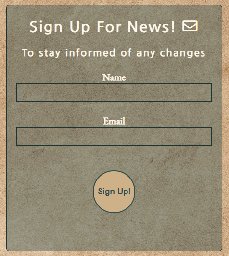


### 2.2 Features left to implement

- __Search function__

    - This feature will allow the user to enter a keyword in a textpox and if it is on the site, the user will be provided with links to the page where it can be found.

    - This feature requires tech outside of the scope for this project

- __Performance tracker__

    - This section will allow a player participating in a game on the continent to view their performance so far by reading information about roll averages, damage done and healing provided.

    - This feature requires tech outside of the scope for this project

## 3. Technologies Used

### 3.1 Languages Used

- [HTML5](https://en.wikipedia.org/wiki/HTML5)
- [CSS3](https://en.wikipedia.org/wiki/CSS)

### 3.2 Frameworks, Libraries and Programs Used

1. [Balsamiq](https://balsamiq.com/)
    - Balsamiq was used to create a wireframe during the design process.

1. [GitPod](https://gitpod.io)
    - GitPod was the IDE used to develop the site.

1. [GitHub](https://github.com/)
    - GitHub was used to store the project code and to deploy the site using GitHub pages.

1. [Google fonts](https://fonts.google.com/)
    - Google fonts was used to compare fonts and find suitable fonts that go well together.

1. [Font Awesome](https://fontawesome.com/)
    - Font awesome was used for symbols to add flavor to the site, and usaed for social media links.

1. [HTML validator](https://validator.w3.org/#validate_by_input)
    - Provided by W3C and used to validate the html on every page.

1. [CSS validator](https://jigsaw.w3.org/css-validator/#validate_by_input)
    - Provided by W3C and used to validate the sites css.

1. [Responsive design checker](https://www.responsivedesignchecker.com/)
    - Used to confirm responsiveness on different devices.

1. [tinypng](https://tinypng.com/)
    - Used to change image file size for shorter loading times without quiality loss.

1. [contrast tester](https://webaim.org/resources/contrastchecker/)
    - The Webaim contrast tester is used to check if contrast was good enough to display text on the selected background.
## 4. Testing

### 4.1 Developmen process
This section vill detail how each part of the site was implemented and tested during development to give an insight to have the site took form. A summary of testing can be found further down.

- __Nav bar__

    The navbar was positioned correctly from the first test, however it became clear that more space was needed between each link. The styling went as intended, with the default styling removed and color and font of the site applied. The active page was given a background color and different text color, and after testing I decided to add some padding to the active class, making the background color cover some area around the text as well. The same style was then applied to the hover pseudo class, which also had its font increased in size to make the link "pop out" when hovered over.

    The entire header is fixed in position. This proved problematic at first, as it would not display apart from on different places of the site. the solution, apart from placing it in the correct position and fixing position, was to adjust z-index to 1. placing it in front of all other elements.

    When adapting the nav bar to smaller screens, I followed a tutorial by [Mark Caron](https://medium.com/@heyoka/responsive-pure-css-off-canvas-hamburger-menu-aebc8d11d793) to create a collapsable menu using only css elements. This code was then adapted to fit the sites layout and coloring. This led to significant testing to find out what part of the css changed what part of the menu. After some toubleshooting, quite a bit of bugfixing due to spelling mistakes, I was able to adapt the menu to fit my intentions. All in all this testing process took about 45 minutes, which compared to other parts of the testing and bugfixing is rather significant.

    The same method used for main menu collapsable for smaller screens was used for subsection menu as well. The code then again had to be adapted to suite the new menu, classes renamed and the css-code changed. This resulted in some testing and bugfixing but the experience of the main menu helped and it was over all a success.

    At the very end of the project, when running the validators I noticed that the subsetion menu were at the wrong side of the screen. It took me a while to find what rule put it on the left side. It was the .sub-menu-burger rule of left:10; that placed it there. Removing that rule put it in the correct place.

- __Landing page__

    After som issues with hero image and finding one that fit both feeling of the page and was large enough, I decided on crumbled pages to give it an "old document" feeling. The covertext proved a bit troublesome, requiring multible adjustments and refeshes using dev tools before the text was aligned according to my wishes and spaced out in the box. The box itself was rather troublesome to place, as I wanted it centered. I found a solution on stack overflow, [here](https://stackoverflow.com/questions/1776915/how-can-i-center-an-absolutely-positioned-element-in-a-div), which helped alot. It is the "Responsive Solution" post that helped. For the main part of the ladning page, a flex box display was used. I followed a tutorial found [here](https://www.w3schools.com/css/css3_flexbox_container.asp#justify-content) on w3s and adapted it to suite my needs. Above the 3 part section there is an information about hte site, simply a paragraph with slightly larger font size and a margin to separate it from the hero image. It took some testing to get the flex box to display the way i wanted, for the "justfity-content: space-between; to work i needed to remove the width of the div containing images.

    When replacing placeholder images with the correct once the entire site bugged out. This was solved by tagetting the images and setting their sizes to inherit from parent element, whose size is controlled by the flexbox display. This rendered the images to display correctly down to a size of 1200px where responsive design will take over.

- __Footer__

    The footer was given opposite coloring to the heder, with background of dark slate grey and color of old lace. When links are highlighted they are colored in the background highlight for header links. This part proved to be pretty straight forward with minor tweaking of margins to get everything in a comfortable position. There is room for social media links, should the world of Iateria have social media platforms in the future.

- __Iateria page__

    The implementation of this page was rather straight forward, not presenting too many issues. After consulting with my mentor we decided to change the layout, so that it alternates between text on the left and text on the right. The structure will then be the same for all information pages, sharing the same styling. 

    - Images
        Some issues with sizing, but much was solved when adding the fixed size for main content container, as suggested by mentor.

    - Padding was added to h3 and p elements to create a more clearly distinguished heirarchy on the page and to make it more obvious what text is connected to which header.

- __Races page__

    To implement this page I simply copied the Iateria page and changed all the text/image content. This worked like a charm on the first four sections. The fifth section, an additional section compared to the Iateria page, did not work as intended however. For some reason, this entire section falls outside of the container div, even though the html is clearly inside it. I have yet to find a solution to this problem (2021-07-20) EDIT: Issue solved by adding the rule "overflow: auto;" to the container class (2021-07-21)
    When adding images to the races and factions pages, I noticed that I needed to add a max hight to pictures, as some pictures would otherwise take up to much space of they were "narrow" in their size ratio. In order to keep the ratio of the image intact I also added the object-fit: contain; rule to all iamges.

- __Factions page__

    Implementing the factions page was very straight forward, as most of the bugs that appeared previously were sorted, and no additional issues arose when adding the factions page. The only thing left to do was adjust the menues as they have different lengths, resulting in padding and margin issues. This was easily solved by adding additional classes and target those in the style.css.

- __Subestcion menu__

    - This menu was originally placed in the container and part of the main content, but has been moved to the header to make the page layout more intuitive. It has also been given a smaller size than the main menu, both on large and small screens, to clearly indicate that it is a sub-menu.

- __Responsive design__

    Implementing responsive design proved less troublesome than I orgininally feared. I decided on three different stylings for the landing page, one for sizes larger than 1200px, one for between 1200-800px and one for smaller than 800px. For the information pages only two layouts are needed, as the layout for larger and medium size work the same, with only smaller screens needing a different approach. As the layout is devided left to right on both landing page and information pages, the decision to stack content vertically on smaller screens felt like the most natural approach. In that case just removing any flex display or float left/right and instead centering content sorted display in of itself.

    After meeting with mentor I got a lot of suggestions on how to align the content properly using paddings, and on the information pages padding text relating to different sections to make it clearer what belongs the what. I was also notified of some hierarchy issues on the landing page, sorted using some additional headings.


### 4.1 Validator testing

The HTML was tested using this [validator](https://validator.w3.org/) with no errors or warnings for any of the .html files

- [Index page](assets/images/readme-images/valid-index.png)

- [Iateria page](assets/images/readme-images/valid-iateria.png)

- [Races page](assets/images/readme-images/valid-races.png)

- [Factions page](assets/images/readme-images/valid-factions.png)

- [Sign up page](assets/images/readme-images/valid-signup.png)

The CSS was tested using this [validator](https://jigsaw.w3.org/) The 9 warnings are all from the part of the hamburger nav bar menues where I followed a tutorial. I decided to keep that code as is, as the code runs ands the nav bar works. When going through the validator code I also noticed that the subsection menu was placed at the wrong side, see nav bar for more info.

- [CSS validation result](assets/images/readme-images/valid-css.png)


### 4.2 Responsiveness and functionality

#### 4.2.1 Responsiveness
The site was tested using responsivechecker.com (see technologies used) for screen sized ranging from 360px to 1900px and was fully functional and responsive on all of them. The only issue found was the the collapsable menues are slightly out of alignment by a few pixels on some of the mobile screen widths.

#### 4.2.2 Browser compability
The site runs euqally satisfactory on Chrome, Firefox, IE, Edge and Safari. 

#### 4.2.3 Contrast testing
- #2F4F4F as background with #FFF7EB as text or reversed passed on all tests with contrast ratio of 8.39
- #1F3333 on #FFF7EB passed all tests with contrast ratio of 12.1.
- #F7AE6E is sometimes used as a background for active or hovered links. It passed all tests.

### 4.3 Unfixed bugs

**FIXED
- Issue with screen scrolling on horizontal axis on some of the smaller screens. I have looked at all the page content to try to find which element that is too wide and causes this issue, but have been unable to find it. it is really bugging me out, pardon the pun, and as of yet the problem is eluding me.<br>
**FIXED
Solution: Adjust width of container div to be somewhat less wide, removing the issue of elements overflowing. The overflow: auto; is still necessary for all elements to fall into the container on pages with alot of content.

- When viewed on a mobile device, all pages leave i thin slice of the body color under the footer. This line does not show up using the inspector on a desktop screen, and I have been unable to find a solution for the problem. 

### 4.4 Testing user Stories

- As an ownder, I want to quickly inform users of what to expect on my site.
    - The landing page offers quick information about what the site is through the cover text and short information paragraph.
    - Centered on the site are the main topics, with links to respective page on the site.

- As an ownder, I want to provide information about the content in a logical and structured way.
    - All information is provided on pages that all have a specific topic.
    - The topics are logically arranged, one with the continent and its history, one with races and one with factions.

- As an ownder, I want to provide ways for users to stay up to date with any changes I make to the content.
    - Both the nav bar and landing page main content has a link to the sign up page, where a form will let the user sign up for a news letter.

- As an ownder, I want to provide the users with ways to find additional reading about the role playing where the setting is used.
    - The footer contains links to further reading about dungeons and dragons, as well as sites providing resources for online role play gaming.

- As a user, I want to find information about a specific topic that i need to read more about.
    - Both landing page and nav bar guides the user to appropriate main topic.
    - A future search function will let the user search for information on the site.

- As a user, I want to find inspiration for creating my own fantasy setting.
    - The topic about Iateria is rich in both inforation and lore, providing ample inspiration for users to build upon.

- As a user, I want to stay up to date with any changes made.
    - Both the nav bar and landing page main content has a link to the sign up page, where a form will let the user sign up for a news letter.

- As a user, I want to learn more about Iateria and possibly use it for my own games.
    - The information pages provide the basic information for a user to set up a game in this setting.
    - The map will let the user select locations for their campaign, and allow the players to select destinations.

- As a user, I want to read about a faction in the setting for creating a character.
    - The factions page provides information about the most important factions that a player character can ally with, or have a conflict with.

- As a user, I want to read about races in the setting to know what my options are when creating a character.
    - The races pages provides information about some of the more common races in the game, and their role in Iateria.

- As a user, I want to find ways to learn more about role playing games in general.
    - The footer contains links for players who after reading the information available on the site want to learn more about DnD or table top role playing games in general.

## 5. Deployment

### 5.1 GutHup Pages

The site was deployed to GitHub pages. The steps to deploy are as follows:
1. Login to [GitHub](https://github.com/) and go to the GitHub repository.
1. In the GitHub repository, navigate to the Settings tab and select the "Pages" options to the left.
1. From the source section drop-down menu, select the Master Branch
1. Once the master branch has been selected, the page will be automatically refreshed with a detailed ribbon display to indicate the successful deployment.

The live link can be found here - https://oljung.github.io/portfolio-project-one/

### 5.2 Make a clone
To clone the repository to make a local copy of it, follow these steps:
1. Login to [GitHub](https://github.com/) and locate the [repository](https://github.com/oljung/portfolio-project-one)
1. Under the repository name, click "Clone or download"
1. To clone the repository using HTTPS copy the link under "clone with HTTPS"
1. Open Git Bash
1. Change directory to where you want the clone to be saved
1. Use the command "git clone" and then paste the url you copied from step 3
```
$ git clone https://github.com/oljung/portfolio-project-one
```
7. Your clone will now be saved, and any commits will be saved to your new repository

## Credits

### Code

- Collapsable navbar
    - This was an adaptation of the work of [Mark Caron](https://medium.com/@heyoka/responsive-pure-css-off-canvas-hamburger-menu-aebc8d11d793)
- Centered div
    - How to center a single div inside a parent element was found on [stack overflow](https://stackoverflow.com/questions/1776915/how-can-i-center-an-absolutely-positioned-element-in-a-div)
- Flex-box
    - A [tutorial](https://www.w3schools.com/css/css3_flexbox_container.asp#justify-content) on how flex-box works was used to handle som of the page content

- README
    - The structure of the readme was heavily influenced by [this repository](https://github.com/Lasserini/stine-poulsen-psykoterapeut) of a fellow CI student

### Content

The concept and idea of Iateria is the work of my good friend Joakim Linde, whom I have asked permission to use his ideas and content for the creation of this wiki.<br><br>

All information on the Iateria, Races and Factions pages are the work of Joakim Linde, written for use in his DnD campains in Swedish and translated by me for this project. All credit for the amazing content goes to him.

### Media

Images used on this site are from these open source galleries: [pixabay](https://pixabay.com/), [unsplash](https://unsplash.com/) and [istock](https://www.istockphoto.com/en).

